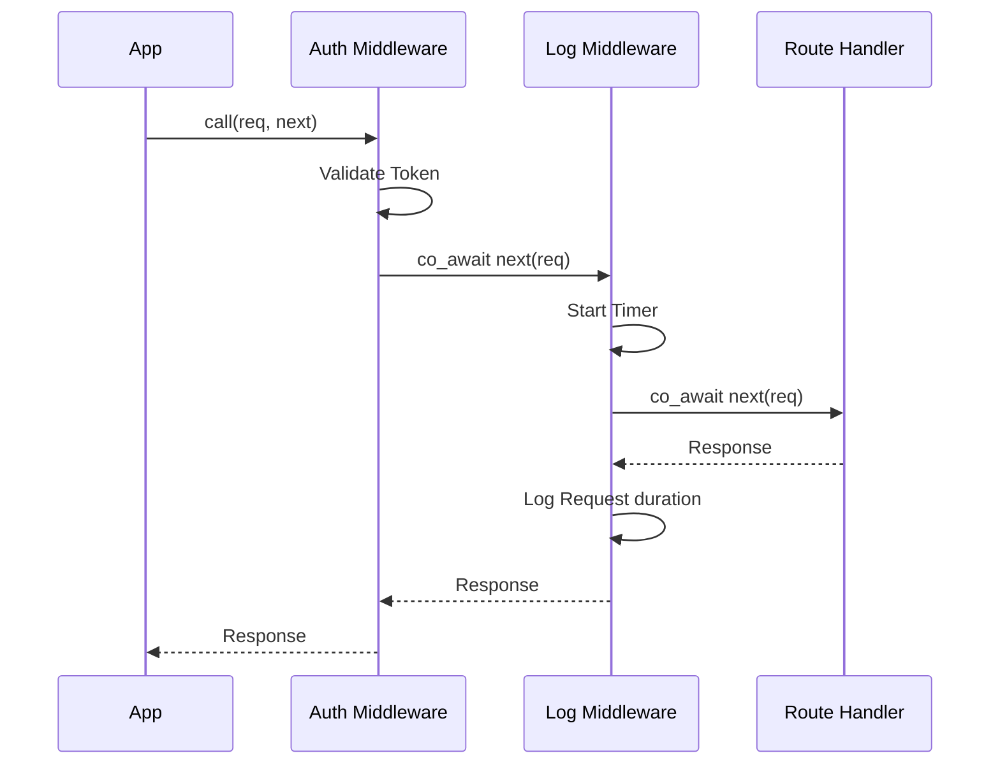

# DFA Routing and Middleware

> [!abstract]
> Coroute uses high-performance DFA-based routing and a recursive middleware system to handle requests efficiently and modularly.

## DFA-Based Routing

The routing system is based on the research in *"Matching Text from Start to Finish Against Multiple Regular Expressions"* (Stankov, 2024). It transforms route patterns into a single Deterministic Finite Automaton (DFA) for $O(N)$ matching complexity, where $N$ is the length of the path.

Relevant files:
- `[[include/coroute/core/router.hpp]]`
- `[[src/core/router.cpp]]`
- `[[src/core/matcher.cpp]]`

### 1. Pattern Conversion

Route templates like `/users/{id}` are converted into regular expressions.
- `{id}` becomes `([A-Za-z0-9_.% -]+)`
- The entire pattern is anchored with `^` and `$`.

### 2. The Matcher

Coroute uses separate matchers for different HTTP methods (GET, POST, etc.) for better isolation.
- **Construction**: When the server starts, it compiles all registered routes for a method into a single NFA and then converts it to a DFA.
- **Execution**: During request handling, the path is fed into the DFA once. The final state reached identifies the route and the capture groups (parameters).

### 3. Captured Parameters

The matcher returns the indices of the captured groups, which Coroute then decodes (including URL decoding) and attaches to the `Request` object.

---

## Middleware System

Middleware in Coroute follows a recursive pattern similar to Koa.js or Gin, but implemented using C++20 coroutines.

Relevant files:
- `[[include/coroute/core/middleware.hpp]]`

### 1. Definitions

```cpp
using Next = std::function<Task<Response>(Request&)>;
using Middleware = std::function<Task<Response>(Request&, Next)>;
```

### 2. Execution Chain

The middleware chain is executed as an onion-style architecture. Each middleware can:
1. **Pre-process**: Do work before calling `next(req)`.
2. **Short-circuit**: Return a `Response` directly without calling `next(req)`.
3. **Post-process**: Do work after `co_await next(req)` returns.



### 3. Implementation Logic

The runtime uses `execute_at(index, request, handler)` to walk the chain:

```cpp
Task<Response> execute_at(size_t idx, Request& req, Handler handler) {
    if (idx >= middleware_list.size()) {
        co_return co_await handler(req); // Base case: the handler itself
    }
    
    // Recursive step: create a 'next' function that points to index + 1
    Next next = [this, idx, &handler](Request& r) -> Task<Response> {
        return execute_at(idx + 1, r, handler);
    };
    
    co_return co_await middleware_list[idx](req, next);
}
```

## Performance Implications

- **Routing**: Fixed $O(N)$ cost regardless of the number of registered routes. This makes Coroute exceptionally fast for APIs with hundreds of endpoints.
- **Middleware**: Minimal overhead due to C++20's symmetric transfer. The recursive lambda calls are optimized by the compiler to direct jumps.

---

## Related Notes
- [[Architecture/Server Runtime and OS Backends|Server Runtime and OS Backends]]
- [[Coroutine Model and Task <T>|Coroutine Model and Task <T>]]
