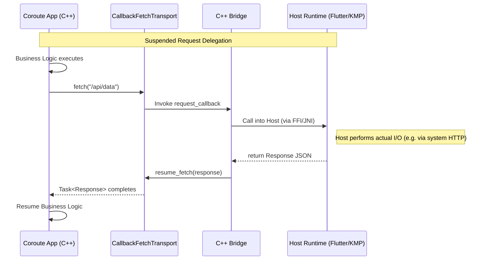

# Framework Integration Architecture

> [!abstract]
> This note describes how Coroute is structured so that the same C++ application logic can run either as a native web server or as a shared engine hosted by a third-party framework. The current concrete host is Flutter, but the architectural boundary is broader than Flutter.

## Architectural goal

Coroute is designed so that application logic does not have to be rewritten for each UI stack.

The intended split is:

- **Coroute engine** owns routes, middleware, business logic orchestration, view-model construction, and transport abstractions.
- **Host framework** owns the target-native UI and the packaging/runtime-specific integration code.

That is why the repository contains both server-side code and adapter code.

## Main integration boundary

The main boundary is a flat exported C ABI backed by Coroute internals.

Relevant files:

- `[[src/bridge/bridge.cpp]]`
- `[[include/coroute/core/app.hpp]]`
- `[[include/coroute/core/callback_fetch_transport.hpp]]`

The bridge exists so external runtimes do not need to understand internal C++ types such as:

- `Task<T>`
- `std::expected`
- `std::any`
- internal router/middleware structures

Instead, the host interacts with a narrowed runtime surface.

## Build-time shape of the integration

The integration architecture starts in the build system, not only at runtime.

`[[cmake/CorouteApp.cmake]]` does several key things:

- builds the app logic as a shared library
- includes `[[src/bridge/bridge.cpp]]` automatically in the shared target
- compiles the app entry point with `main=app_main`
- enables template/view support
- writes `.coroute_lib_path.<target>` files into the Flutter package directory as a build handoff
- defines separate run targets for mobile, desktop, and web/server modes

> [!note]
> This is an example of a structural integration approach: the build system shapes the engine for the host runtime instead of relying on ad hoc manual post-build steps.

## Runtime responsibilities of the bridge

At runtime, the bridge handles several categories of work.

### 1. App initialization

The exported `init_app()` entry point starts the app in a background thread and waits for the `App` instance so transport/broadcast hooks can be injected.

### 2. View and action requests

The host can request a view or submit an action through exported functions that turn the result into a JSON payload suitable for the foreign runtime.

### 3. Fetch transport delegation

Coroute can delegate HTTP work through `CallbackFetchTransport`, allowing a foreign runtime to perform the actual network I/O and then resume the suspended C++ coroutine.

### 4. Broadcast delivery

Coroute can emit out-of-band events that the host consumes as stream-like updates.

Relevant files:

- `[[src/bridge/bridge.cpp]]`
- `[[include/coroute/core/callback_fetch_transport.hpp]]`
- `[[packages/Flutter/coroute_framework/lib/bridge.dart]]`

## Why `packages/` matters

The `packages/` directory is the repository's adapter layer.

Current state:

- `[[packages/Flutter/TECHNICAL_SPEC.md]]` and `[[packages/Flutter/coroute_framework/pubspec.yaml]]` contain the active reusable package contract and implementation anchors.
- `packages/KotlinMultiPlatform/` currently represents a future adapter direction rather than an implemented package.

This means the repository is not only a framework library; it is also the place where host-runtime adapters are defined.

## Engine invariants that adapters should preserve

A host adapter should preserve these architectural properties:

- route selection stays in Coroute
- business logic stays in Coroute
- the view model is serialized out of Coroute rather than recreated in the host
- the host maps template identifiers to its own native presentation primitives
- transport bridging should remain in the adapter, not leak into application-level screens

## Current concrete host: Flutter

Flutter is the implemented example of this integration pattern.

That path is documented in:

- [[Architecture/Flutter Integration]]
- [[Renderers/Flutter Renderer Contract]]
- [[packages/Flutter/TECHNICAL_SPEC.md]]

## Future host direction: Kotlin Multiplatform

Kotlin Multiplatform has a directory in `packages/`, but during this pass I did not find an implemented runtime adapter comparable to `coroute_framework`.

That makes it a roadmap/documentation topic rather than a finished integration surface.

See:

- [[Renderers/Kotlin Multiplatform Renderer Roadmap]]

## Status

### Current status

- **Implemented**: the repository contains a concrete FFI/export layer in `[[src/bridge/bridge.cpp]]`.
- **Implemented**: the build system can shape a Coroute app into a shared library for a host runtime through `[[cmake/CorouteApp.cmake]]`.
- **Implemented**: Flutter is the current full adapter path.
- **Planned/future-facing**: Kotlin Multiplatform appears present as a repository direction, but I did not find an equivalent implemented package surface in this pass.

## Related notes

- [[Architecture/Project Atlas]]
- [[Architecture/View and API Abstractions]]
- [[Architecture/Server Runtime and OS Backends]]
- [[Architecture/Flutter Integration]]
- [[Renderers/Renderers and Template Engines]]
- [[Renderers/Kotlin Multiplatform Renderer Roadmap]]
