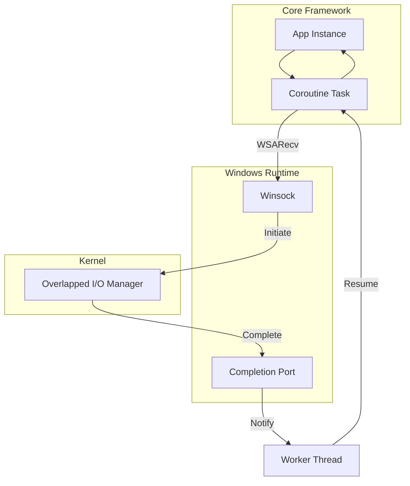

# IOCP Backend (Windows)

> [!abstract]
> On Windows, Coroute v2 uses I/O Completion Ports (IOCP). This is a true asynchronous completion model where the OS performs the I/O and notifies the application only when the work is finished.

## Architecture

The IOCP backend uses a pool of worker threads that wait on a single `HANDLE` (the Completion Port).



## Utilized Features

### 1. AcceptEx (Fast Connect)
- **Where**: `IocpContext::create_accept_op`.
- **Why**: Standard `accept()` requires a new socket allocation *after* the connection arrives. `AcceptEx` allows Coroute to pre-allocate a pool of sockets and hand them to the kernel.
- **Benefit**: Zero-latency connection acceptance. Under heavy load, this prevents the "Accept Bottleneck" where the OS cannot keep up with incoming SYN packets.

### 2. Overlapped Buffer Passing
- **Where**: `IocpOperation` structure.
- **Logic**: Coroute passes the C++ buffer address directly to `WSARecv`. The OS kernel fills this buffer directly via DMA.
- **Impact**: Truly Zero-Copy I/O. Unlike Linux `epoll` which copies from kernel buffer to user buffer after readiness notification, Windows IOCP puts data exactly where the coroutine wants it.

### 3. LIFO Thread Scheduling
- **Where**: Handled internally by the Windows kernel for IOCP.
- **Mechanism**: The kernel releases threads from the completion port in Last-In-First-Out order.
- **Benefit**: Keeps the "hottest" cache lines (CPU L1/L2) active, significantly improving medium-to-heavy load latency.

## Unutilized Features & Industry Context

| Feature | Status | Rationale |
| :--- | :--- | :--- |
| **Registered I/O (RIO)** | ❌ Not Used | **Complexity vs. Gain**. RIO is significantly faster but requires pre-allocating large chunks of pinned memory ("Buffer Containers"). For a general web framework, the memory rigidity of RIO usually outweighs the throughput gain. |
| **Skip Completion on Success** | 🚀 Planned | **Tuning Feature**. `FILE_SKIP_COMPLETION_PORT_ON_SUCCESS` avoids a context switch if the data is already in the NIC buffer. Implementation requires a complex "hybrid" path in the coroutine awaiter. |
| **GQCSEx (Batching)** | ⚠️ Research | **GetQueuedCompletionStatusEx**. Allows pulling multiple completions at once. Currently, Coroute pulls one by one to keep the coroutine resumption logic simple and low-latency. |
| **ConnectEx** | ❌ Not Used | **Client-side only**. Coroute is primarily a server framework; outgoing connection performance is less critical than incoming `AcceptEx` throughput. |

## Performance under Load

1. **Low Load**: IOCP has a slightly higher "startup" cost than `kqueue` because of the overhead of managing `OVERLAPPED` structures and kernel object creation.
2. **Medium Load**: IOCP shines due to its worker thread throttling. The kernel ensures that if you have 8 cores, exactly 8 threads are running, preventing context-switch thrashing.
3. **Heavy Load**: IOCP is arguably the most stable of all backends. While `io_uring` can hit higher peak numbers, IOCP's "proactive" model ensures that under extreme pressure, memory usage remains predictable because the OS throttles the flow of completions.

## Deep Internals: The "Proactive" Model

Windows IOCP is the *only* backend in Coroute that is truly proactive:

```cpp
// WSARecv doesn't wait for data; it initiates a kernel transfer immediately.
int result = WSARecv(socket, \u0026buf, 1, \u0026bytes, \u0026flags, \u0026op-\u003eoverlapped, nullptr);
if (result == SOCKET_ERROR \u0026\u0026 WSAGetLastError() != WSA_IO_PENDING) {
    // Immediate error
}
```
The coroutine suspends immediately, and the buffer is "locked" by the kernel until the completion port fires.

```cpp
// Logic inside iocp_context.cpp
struct IocpOperation : OVERLAPPED {
    std::coroutine_handle<> continuation;
    // ...
};
```

## Relevant Files
- `[[src/net/iocp/iocp_context.cpp]]`
- `[[include/coroute/net/io_context.hpp]]`
