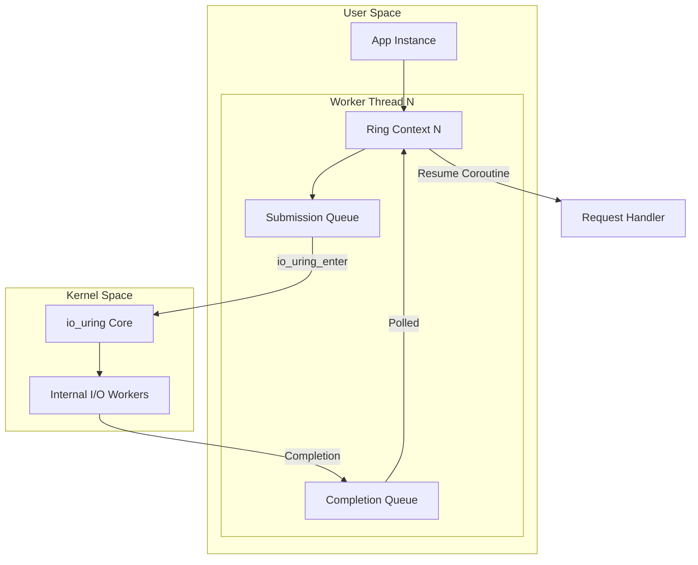

# io_uring Backend (Linux)

> [!abstract]
> On Linux, Coroute v2 leverages `io_uring` for high-performance, asynchronous, non-blocking I/O. This backend is designed for extreme scalability by minimizing kernel-user transitions.

## Architecture

Coroute's `io_uring` implementation uses a **Per-Thread Ring** model to avoid lock contention between CPU cores.



## Utilized Features

### 1. Per-Thread SQ/CQ Isolation
- **Where**: `WorkerRing` structure in `uring_context.cpp`.
- **Why**: Eliminates lock contention at the submission queue level. High-load throughput benefits significantly from 0% lock-waits between worker threads.
- **Performance Impact**:
    - **Low Load**: Negligible.
    - **Heavy Load**: Critical. Avoids the "scaling wall" seen in frameworks with a single event loop or global locking.

### 2. CQE Batch Processing
- **Where**: Main polling loop uses `io_uring_peek_batch_cqe`.
- **Logic**: Instead of processing one completion at a time, we drain up to 512 CQEs per cycle.
- **Impact**: Reduces context switches and improves instruction cache locality by processing multiple resumption tasks in one "resumption storm."

### 3. Kernel-Side I/O Offloading (vFS)
- **Where**: `io_uring_prep_send`/`io_uring_prep_recv`.
- **Benefit**: The kernel handles the actual state machine of the TCP stack asynchronously. Coroute only cares when the bytes are actually transferred.

## Unutilized Features (Backlog & Rationale)

| Feature                       | Status     | Rationale                                                                                                                                                                                                         |
| :---------------------------- | :--------- | :---------------------------------------------------------------------------------------------------------------------------------------------------------------------------------------------------------------- |
| **SQPOLL**                    | ❌ Not Used | **Wasteful Power Profile**. SQPOLL spins a kernel thread at 100% CPU. While it removes the `io_uring_enter` syscall entirely, it's inefficient for general-purpose web servers where traffic can be bursty.       |
| **Registered Buffers**        | ❌ Not Used | **Dynamic Lifecycle**. Coroute uses a flexible buffer system for View templates. Registering/unregistering buffers adds more overhead than it saves unless buffers are long-lived (e.g., in a DB engine).         |
| **Multishot Accept**          | ⚠️ Partial | **Kernel Version Dependency**. Multishot accept requires Linux 5.19+. To maintain compatibility with older LTS kernels (like Ubuntu 20.04), Coroute uses single-shot accept by default.                           |
| **IORING_SETUP_COOP_TASKRUN** | 🚀 Planned | **Latency Optimization**. Newer kernels allow completions to keep the process on the same CPU, avoiding expensive IPIs (Inter-Processor Interrupts). Implementation is pending kernel capability detection logic. |

## Deep Internals: The "Awaiter" Pattern

The interaction with coroutines relies on `UringOperation` being 1:1 mapped to a `Submission Queue Entry (SQE)`. 

```cpp
// Example of a prep_send implementation
auto await_suspend(std::coroutine_handle<> h) {
    auto* sqe = get_sqe();
    io_uring_prep_send(sqe, fd, buf, len, MSG_NOSIGNAL);
    io_uring_sqe_set_data(sqe, this); // 'this' is the UringOperation
    // Coroutine is now suspended. The kernel owns the 'this' pointer.
}
```

## Performance under Load

1. **Low Load (<1k req/s)**: System call overhead is the dominant cost, but since traffic is low, the difference between `io_uring` and `epoll` is minimal.
2. **Medium Load (10k-50k req/s)**: Batching starts kicking in. `io_uring` starts saving ~15% CPU compared to `epoll` due to fewer syscalls per request.
3. **Heavy Load (>100k req/s)**: The "Single-Syscall Submission" shines. Processing thousands of requests with a few `io_uring_enter` calls keeps the CPU in user-land longer, maximizing throughput.

```cpp
// Logic inside uring_context.cpp
void await_suspend(std::coroutine_handle<> h) noexcept { 
    op.continuation = h; 
    // ... submit to SQE ...
}
```

## Relevant Files
- `[[src/net/io_uring/uring_context.cpp]]`
- `[[include/coroute/net/io_context.hpp]]`
