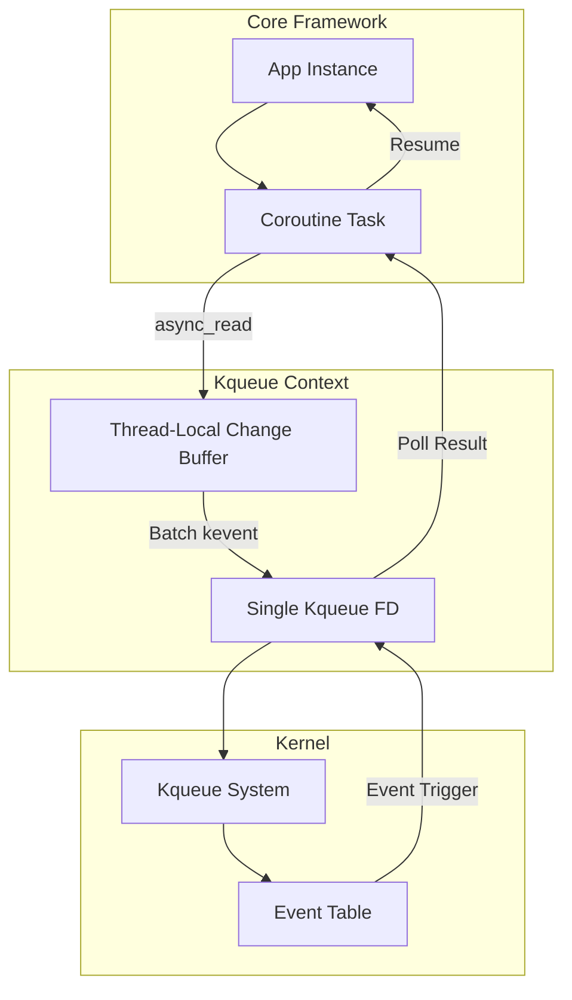

# kqueue Backend (macOS/BSD)

> [!abstract]
> On macOS, Coroute v2 uses the `kqueue` event notification mechanism. This backend is optimized for the Darwin kernel, providing efficient event polling for sockets and files.

## Architecture

Coroute's `kqueue` implementation uses a multi-threaded worker loop sharing a central `kqueue` handle, but with **thread-local submission batching**.



## Utilized Features

### 1. EV_ONESHOT Lifecycle
- **Where**: `kqueue_context.cpp` in `EV_SET` macros.
- **Why**: Coroutines represent a "one-off" state transition (wait for read -> resume -> compute -> wait for write). `EV_ONESHOT` automatically removes the event from the kernel's interest list after delivery, saving a second system call to "unregister."
- **Benefit**: Significantly reduces kernel-to-user-to-kernel traffic for short-lived HTTP connections.

### 2. Thread-Local kevent Batching
- **Where**: `pending_changes_` vector.
- **Logic**: Instead of calling `kevent()` every time a coroutine suspends, we push a `struct kevent` into a thread-local buffer. When the worker loop is about to idle/poll, it flushes the entire buffer in a single `kevent(..., n_changes, ...)` call.
- **Impact**: Reduces syscall frequency by a factor proportional to the number of concurrent coroutines.

### 3. User-Data (udata) Mapping
- **Where**: The last argument of `EV_SET` is the `KqueueOperation*`.
- **Logic**: Directly maps the kernel event back to the C++ object without hash table lookups.
- **Benefit**: O(1) resumption logic.

## Unutilized Features & Industry Context

| Feature | Status | Rationale |
| :--- | :--- | :--- |
| **EV_CLEAR** | ❌ Not Used | **Edge-Triggered overhead**. Level-triggered (the default) is safer for Coroute's generic I/O. `EV_CLEAR` would require the framework to loop until `EAGAIN` for every event, which is redundant with the `EV_ONESHOT` + coroutine suspension model. |
| **EV_DISPATCH** | ❌ Not Used | **Performance Cost**. `EV_DISPATCH` disables the filter but keeps it in the kernel. In a busy web server with thousands of closed connections per second, this causes knote leakage/thrashing. `EV_ONESHOT` is cleaner for ephemeral web sockets. |
| **EVFILT_VNODE** | ⚠️ Not Core | **File Watching**. Used for hot-reloading templates (View engine), but not utilized in the high-performance networking data path. |
| **EV_RECEIPT** | 🚀 Proposed | **Bulk Error Handling**. Could be used to verify that a large batch of registrations (e.g., during server startup or massive spikes) succeeded without actually draining events. |

## Performance under Load

1. **Low Load**: `kqueue` is extremely efficient on macOS/BSD. The system call cost is lower than `epoll` registration costs because of the single-call `kevent` API (which does both registration and polling).
2. **Medium Load**: The batched `pending_changes_` ensures that as concurrency grows, the overhead per-request decreases.
3. **Heavy Load**: `kqueue` performance remains stable, but it can be outpaced by Linux `io_uring` because `io_uring` avoids the `kevent` system call entirely during polling if using SQPOLL/batching, whereas `kqueue` always requires at least one syscall per poll cycle.

## Deep Internals: The "Changelist" Optimization

Coroute implements a manual changelist management system similar to the one used in `libevent` or `nginx`:

```cpp
// Flushes pending registrations before polling
int n = kevent(kq_fd_, pending_changes_.data(), pending_changes_.size(), 
               ready_events_.data(), ready_events_.size(), timeout);
pending_changes_.clear();
```
This is the "Golden Path" of kqueue performance.

```cpp
// Logic inside kqueue_context.cpp
void register_read_op(int fd, KqueueOperation* op) {
    struct kevent ev;
    EV_SET(&ev, fd, EVFILT_READ, EV_ADD | EV_ONESHOT, 0, 0, op);
    pending_changes_.push_back(ev); // Batched!
}
```

## Relevant Files
- `[[src/net/kqueue/kqueue_context.cpp]]`
- `[[include/coroute/net/io_context.hpp]]`
