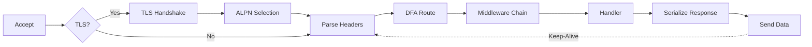
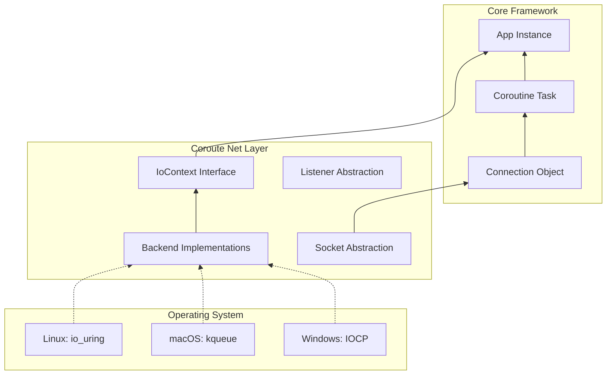
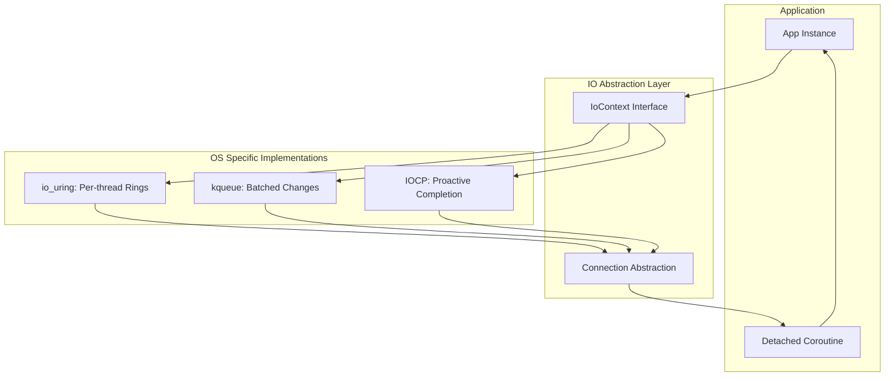

# Server Runtime and OS Backends

> [!abstract]
> This note describes the runtime path from `App::run()` down into the operating-system specific event loops. It covers how Coroute accepts connections, routes work into detached coroutines, and hides Linux, macOS, and Windows backend differences behind `IoContext`.

## Runtime entry point

The server/runtime story starts in `App`.

Relevant files:

- `[[include/coroute/core/app.hpp]]`
- `[[src/core/app.cpp]]`

The same class can run in two broad modes:

- **server mode** via `run(RunOptions{.port = ...})`
- **client/embedded mode** via `run(RunOptions{.api_domain = ...})`

This note focuses on server mode, but the shared runtime machinery is reused by the embedded path.

## HTTP request lifecycle

The request path in Coroute is a series of `co_await` points. Each stage is non-blocking, allowing the thread to return to the `IoContext` while waiting for I/O or processing.

### 1. Accept
The `IoContext` monitors the listening socket. When a connection arrives, it is **moved** into a detached `[[Architecture/Coroutine Model and Task T|Task<void>] ]`.

### 2. TLS & ALPN
If enabled, the server performs an asynchronous TLS handshake. During this phase, **ALPN (Application-Layer Protocol Negotiation)** determines whether to use HTTP/2 or fallback to HTTP/1.1.

### 3. Parse
Data is read in chunks until the header terminator (`\r\n\r\n`) is reached. Coroute uses a zero-copy-oriented parser to minimize string allocations.

### 4. Route & Middleware
The `[[Architecture/DFA Routing and Middleware|DFA Matcher]]` finds the handler in $O(N)$ time. The request then passes through the middleware chain (auth, logging, etc.).

### 5. Handler & Response
The user-defined `co_await` handler executes business logic. The `Response` is then serialized and sent via native I/O (using `sendfile` or `TransmitFile` for static files).

Relevant files:

- `[[src/core/app.cpp]]`
- `[[include/coroute/core/app.hpp]]`
- `[[include/coroute/net/io_context.hpp]]`
- `[[doc/v2/en/chapters/04_architecture.tex]]`

## `IoContext` as the abstraction boundary

`IoContext` is the interface that isolates the rest of Coroute from the OS-specific event loop implementation.

Core responsibilities exposed by the interface:

- run and stop the event loop
- post callbacks back into the loop
- schedule delayed work
- optionally enable multi-accept mode

Related files:

- `[[include/coroute/net/io_context.hpp]]`
- `[[src/net/event_loop.cpp]]`
- `[[src/net/socket.cpp]]`

## Platform-specific backends

The concrete backend is selected in `[[CMakeLists.txt]]`.

### Linux

- **Backend**: `io_uring`
- **Implementation**: `[[src/net/io_uring/uring_context.cpp]]`
- **Details**: Read [[Architecture/OS Backends/io_uring]] for per-thread ring details.

### macOS

- **Backend**: `kqueue`
- **Implementation**: `[[src/net/kqueue/kqueue_context.cpp]]`
- **Details**: Read [[Architecture/OS Backends/kqueue]] for batching and one-shot logic.

### Windows

- **Backend**: `IOCP`
- **Implementation**: `[[src/net/iocp/iocp_context.cpp]]`
- **Details**: Read [[Architecture/OS Backends/IOCP]] for proactive I/O and AcceptEx.

> [!note]
> The OS abstraction is a structural design choice, not a portability afterthought. Higher layers depend on `IoContext`, `Listener`, and `Connection` rather than on per-platform APIs.

## Accept loop and connection ownership

In server mode, `App::run()` creates the listener and then starts an accept loop.

Important runtime characteristics:
- New connections are moved into detached coroutines.
- Detached coroutines own their connection object (RAII).
- Memory safety is enforced via move semantics.

Read more in **[[Coroutine Model and Task <T>]]**.

Relevant files:

- `[[src/core/app.cpp]]`
- `[[include/coroute/coro/task.hpp]]`
- `[[include/coroute/coro/cancellation.hpp]]`

## Middleware and routing in the runtime path

The runtime does not directly invoke handlers after parsing a request. It goes through a high-performance matching and filtering layer.

- **DFA Matcher**: $O(N)$ path lookup.
- **Middleware Chain**: Recursive `co_await` onion architecture.

Read more in **[[Architecture/DFA Routing and Middleware]]**.

Relevant files:

- `[[include/coroute/core/app.hpp]]`
- `[[include/coroute/core/router.hpp]]`
- `[[src/core/router.cpp]]`

## Protocol branching inside the runtime

Once a connection exists, the runtime may branch into specialized protocol handling:

- TLS handshake and ALPN negotiation
- HTTP/2 connection handling
- WebSocket upgrade and WebSocket session handling
- plain HTTP/1.1 request/response flow

Relevant files:

- `[[src/core/app.cpp]]`
- `[[include/coroute/net/tls.hpp]]`
- `[[include/coroute/net/websocket.hpp]]`
- `[[include/coroute/http2/connection.hpp]]`

## Graceful shutdown

`App::shutdown(...)` is designed to:

- stop accepting new connections
- wait for in-flight work to drain
- force cancellation after a timeout when configured
- stop the event loop when draining completes or times out

Relevant files:

- `[[include/coroute/core/app.hpp]]`
- `[[src/core/app.cpp]]`
- `[[doc/v2/en/chapters/04_architecture.tex]]`

## Example and usage anchors

- `[[examples/Samples/hello_world/main.cpp]]`
- `[[examples/Samples/https_server/main.cpp]]`
- `[[examples/Samples/http2_server/main.cpp]]`
- `[[examples/Samples/websocket_server/main.cpp]]`

## Status

### Current status

- **Implemented**: platform-selected event-loop backends, listener/connection abstractions, runtime accept loop, and graceful shutdown support.
- **Implemented**: protocol branching for TLS, HTTP/2, and WebSocket is visible from the `App` runtime path.
- **Observed build selection**: backend choice is encoded in `[[CMakeLists.txt]]`.
- **Testing note**: protocol-specific tests exist for HTTP/2 and compression; I did not find backend-specific test files named for `io_uring`, `kqueue`, or `IOCP` in `[[tests]]` during this pass.

## Related notes

- [[Architecture/Project Atlas]]
- [[Architecture/View and API Abstractions]]
- [[Architecture/Framework Integration Architecture]]
- [[Protocols/Protocols Index]]
- [[Protocols/HTTP-1.1]]
- [[Protocols/HTTP-2]]
- [[Protocols/WebSocket]]
- [[Protocols/TLS]]
